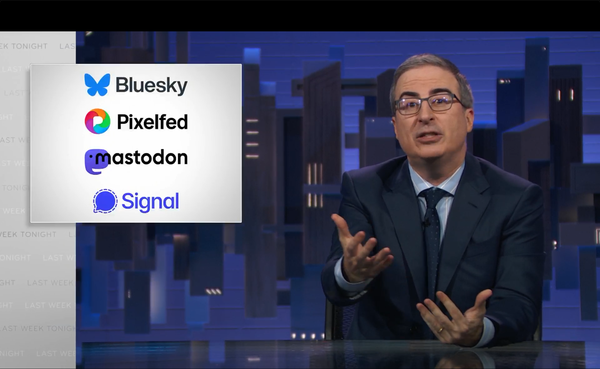

# The 4th Wave of Social-Media: The Rise of Decentralized Networks

**Social-Media is evolving — again.**
From MySpace to Facebook, from Twitter to TikTok, each iteration has reshaped how we connect.
Now, a new revolution is here: **decentralized social-media** (**DeSo**).
But what exactly is it, and how does it differ from what came before?
Let’s dive into the **4th wave of social-networking**.

## 3rd Wave

The **4th wave** of social-media marks a **new wave** — and includes **Bluesky**, **Farcaster**, the **Fediverse**, **Mastodon**, **Nostr**, and **Pixelfed**, among others.

But knowing the _previous_ **3rd wave** will help us understand the _new_ **4th wave**.

The _previous_ **3rd wave** of social-media includes many names that (at the time of writing this article) many people around the world are familiar with, such as:
Aparat,
Discord,
Facebook,
Instagram,
KakaoTalk,
Reddit,
Slack,
Snapchat,
Telegram,
TikTok,
Twitter,
VK,
WeChat,
Weibo,
WhatsApp,
YouTube,
and many others.

But, also includes many less familiar and now defunct names, such as:
Advogato,
Brightkite,
Busker,
Delicious,
Digg,
Flickr,
Foursqure,
FriendFeed,
Friendster,
Google Plus,
Kuro5hin,
Orkut,
Periscope,
Posterous,
MySpace,
Tumblr,
Vine,
and many others.

With some exception, the previous **3rd wave** of social-media can largely be characterized as:

* **centralized**
* **walled-gardens**
* **data-silos**
* **corporate owned & controlled**
* **profit focused**
* **engagement maximizing**
* **vendor lock-in**

## 4th Wave

Probably the two most well-known instances from this new social-media revolution — from this **4th wave** of social-media — are [Mastodon](https://joinmastodon.org/) & [Bluesky](https://bsky.app/), as they have been received extensive newspaper coverage.
[Pixelfed](https://pixelfed.org/) has also received newspaper attention.
And, all 3 of these — Bluesky, Pixelfed, and Mastodon — were even recommended by (the famous) John William Oliver on his "Last Week Tonight" TV show in February 2025.

A big name in the **4th wave** is: **the Fediverse**.
Traditionally, **the Fediverse** has included **Mastodon**, **Pixelfed**, and any other software that _"speaks"_ and _"understands"_ the  ActivityPub _et alia_ protocols, but — as time goes on, in practice, many are including **Bluesky** as part of the **federated universe** that is **the Fediverse** (despite it (Bluesky) _"speaking"_ and _"understanding"_ the ATProto _et alia_ protocols).
Meta / Facebook's [Threads](https://www.threads.net/) is (at the time of writing) in the process of joining the Fediverse, and onboarding its hundreds-of-millions of users to this new decentralized world.

Nostr is another significant decentralized social-media (DeSo) network.
It (Nostr) is also the new home of Twitter founder and former CEO [Jack Patrick Dorsey](https://primal.net/jack).
He (Jack) has also been a vocal supporter of Nostr, and has providing funding to help various developers and organizations building applications and infrastruction for Nostr.

[Farcaster](https://www.farcaster.xyz/) is another significant but small decentralized social-media (DeSo) network.
In fact, **Farcaster** currently (at the time of writing) the smallest of the (significant) decentralized social-media (DeSe) networks.
...

**Later in this article we will go over each of these more in depth.**

In constrast to the **3rd wave**, with some exceptions, this new **4th wave** of social-media can largely be characterized as:

<table>
	<thead>
		<tr>
			<th>&nbsp;</th>
			<th width="30%">3rd Wave</th>
			<th width="50%">4th Wave</th>
		</tr>
	</thead>
	<tbody>
		<tr>
			<th>CONTROL</th>
			<td>centralized</td>
			<td>decentralized & localized</td>
		</tr>
		<tr>
			<th>ENVIRONMENT</th>
			<td>walled-gardens</td>
			<td>open platforms</td>
		</tr>
		<tr>
			<th>ACCESS</th>
			<td>data-silos</td>
			<td>
				open & permissionless
				  
				(protocols, access to data, APIs)
			</td>
		</tr>
		<tr>
			<th>OWNERSHIP</th>
			<td>corporate owned & controlled</td>
			<td>open-source & decentralized ownership</td>
		</tr>
		<tr>
			<th>FOCUS</th>
			<td>profit focused</td>
			<td>
				locally focused
				  
				(individual, family, community, team, or organization)
			</td>
		</tr>
		<tr>
			<th>INCENTIVIZATION</th>
			<td>engagement maximizing</td>
			<td>relationship building</td>
		</tr>
		<tr>
			<th>ESCAPABILITY</th>
			<td>vendor lock-in</td>
			<td>
				self-sovereignty
				  
				(own your own online identity, own the relationship with your followers, control the abililty to communicate with your followers)
			</td>
		</tr>
	</tbody>
</table>

But, why these differences‽
Why do those matter‽

Knowing a bit of history can help us understand this.

## Computing & Computer Networks

It is easy to _take for granted_ how ubiquitous **computing** has become — computing is everywhere.
Laptops,
tablets,
mobile phones,
gaming consoles,
arcade machines,
smart watches,
printers,
WiFi routers,
the cloud,
_and more_.

And, easy to _take for granted_ how ubiquitous **computer networks** have become. With ...., and the (much of) _the sum of all human knowledge_ available ....

# 1970s

Nowadays, it is difficult for many to imagine a world where computing was rare or non-existant.
And yet, for most people, that was what the world was like for most of the 20th century and before.

If we could take a time-machine back to the mid- 1970s — ...

In fact, I was there, in the 1970s — a young child growing up in Metro Vancouver.
Metro Vancouver, named after the city of _Vancouver_, is a collection of cities on the west-coast of Canada.
Metro Vancouver is also close enough to the United States, and in particular Seattle, that they culturally affected each other.

As a kid in the 1970s, I remember watching live-action kids' TV shows such as: **Sesame Street**, **Boomerang** with Marni Nixon, and **Mr. Dressup**.
I remember watching cartoons such as: **Super Friends**, **The Scooby-Doo Show**, ....
I remember playing with ....
I remember seeing my father's ABBA (music) cassette tapes.
And, I remember ....
...

I also remember that, although bell-bottom jeans were fashionable, a lot (probably most) people didn't wear them.
(Although I have seen photos of my mother wearing bell-bottom jeans when she was young. Which isn't surprising as, the young are often _more susceptible_ to many types of fashions.)

hippie era ...

I also remember that electronics were rare.
A family would probably would have a television (TV) — that by today's standards would be considered _small_ and _bulky_.
I recall that one of our first TVs we got was a black-and-white TV.
It was only later that we got a color TV.
Families would also often have a radio.
Nowadays, radios tend to only be common inside of automobiles, but — ...

## Home Computer

The mid- 1970s is also the start of the **home computer** era — a time when it became more practical for a family to own a computer.
This era continued into the 1980s.

(This is an era of computing _before_ the **personal computer** era that ....)

The popular computers during this **home computer** era (in alphabetical order) included
—
the **Acorn Electron**,
the **Amiga 1000**,
the **Apple II**,
the **Atari ST**,
the **BBC Micro**,
the **Coleco Adam**,
the **Commodore 128**,
the **Commodore 64**,
the **Commodore PET**,
the **Mattel Aquarius**,
the **Radio Shack TRS-80**,
the **Sinclair ZX Spectrum**,
the **Sinclair ZX80**,
the **VIC-20**,
and many others.

(One needs to be careful not to project the present ... onto the past.
And although Apple has dominance in certain markets today — **Commodore** and **Sinclair** were more important back then.)

Note that, unlike the later _personal computer_ era, software for a particular _home computer_ tended to **not** work with other _home computers_.
Especially if the _other home computer_ was created by another manufacturer.

Although, what often created some compatibility between different incompatible _home computers_ was the BASIC programming-language.

What I remember of this time is — although it was _more practical_ for a family to own a computer, it was still pretty rare.
For example, in the early 1980s, I recall only one family in my neighborhood having Commodore 64 — the most popular ...
My elementary school also had ..., which where I first learned _computer programming_ via the Logo programming-language (and _turtle graphics_).

...

## Computer Networks

Back then, there were those who wondered what regular people would do with computers.
Sure there were video games, but —
after all, prior to this, computers tended to be used for:
accounting, databases, inventory management, payroll, simulations, etc.
I.e., things that were more .... use-cases that were more common for business, researchers, and military.

As it turns out, some regular people used computers to do what they did away from the computer — they used them to be **social** with _other people_.

And thus, computers and computer networks became **social-media**.

## Social Media

medium (noun): a means, channel, go-between, etc, through which communication, commerce, etc, happens.

The "media" is social-media is the plural form of "medium".

social (adjective): of or relating to a society.

society (noun): a group of people, where members potentially come and go, plus the relationships, history, culture, etc, within them.

## Pre-Internet

Today, the computer network most people know is: **the Internet**.
And, there is a history that is told about _computer networks_ that says, _what came before the Internet was ARPANET_.

That story is at best misleading, and perhaps a bit of a lie.
At least for the story of _regular people_ using the computer networks.

For regular people the computer networks that came before **the Internet** includes (in alphabetical order): AOL, BBS, CompuServe, FidoNet, GEnie, MCI Mail, Prodigy, Usenet, and others.

## Bluesky

## Mastodon

## Pixelfed

## The Fediverse

There are many different platforms that comprise the Fediverse — including:

* [Akkoma](https://akkoma.social/) — micro-blogging platform
* [Bookwyrm](https://bookwyrm.social/) — ...
* [Castopod](https://castopod.org/) — ...
* Friendica — ...
* Firefish — ...
* Ghost — ...
* GNU Social — ...
* GoToSocial — ...
* [GreatApe](https://greata.pe/) — conversations platform
* [Hollo](https://docs.hollo.social/) — single-user micro-blogging platform
* Iceshrimp — ...
* Lemmy — ...
* Loops — ...
* Mangane — ...
* Mastodon — ...
* Mbin — ...
* Micro.Blog — ...
* Misskey — ...
* Mobilizon — ...
* NextCloud — ...
* NodeBB — ...
* PeerTube — ...
* Pixelfed — ...
* [Pleroma](https://pleroma.social/) — micro-blogging platform
* [Postmarks](https://postmarks.glitch.me/) — single-user social-bookmarking platform
* ProToGo — ...
* Sharkey — ...
* WordPress — ...
* WriteFreely — ...

## Nostr

...

**Nostr** ... .

**Nostr** ... Twitter founder and former CEO, Jack Patrick Dorsey.

...

## Farcaster

[Farcaster](https://www.farcaster.xyz/) is a micro-blogging social-media network, similar to Twitter, Bluesky, and Mastodon.
Farcaster has also received attention, due to [raising funds](https://techcrunch.com/2024/05/21/farcaster-a-crypto-based-social-network-raised-150m-with-just-80k-daily-users/).

**Farcaster** is currently the smallest of the **decentralized social-media** (**DeSo**) networks.
But, the importance of a social-media network is _not_ just about _how many people_ are on the social-network, but also **who** is on the network.

To understand that, though, you need to understand how the _blockchain community_ is structured.
But, to understand the blockchain community, you need to be aware of the existence of a major split in blockchain community.

The world of blockchain is divided into 2 large camps — the Bitcoin world and _everyone else_ (who isn't Bitcoin).
In this latter camp — _everyone else (who isn't Bitcoin_) — Ethereum is the largest player.
This _latter camp_ also includes things that are similar to Ethereum, such as:
[Arbitrum](https://arbitrum.io/),
[Avalanche](https://www.avax.network/),
[Base](https://www.base.org/),
[Cosmos](https://cosmos.network/),
[Optimism](https://www.optimism.io/),
[Polkadot](https://polkadot.com/),
[Polygon](https://polygon.technology/),
[Sonic](https://www.soniclabs.com/),
Zora,
and many, many others.
But, this _latter camp_ also includes things that are dissimilar to Ethereum, such as:
[Solana](https://solana.com/),
[Sui](https://sui.io/),
and others.

So, **who** is on Farcaster‽
Farcaster is not only a home for many from this _latter camp_ (of _everyone else_) of the blockchain community, but — it is home for many of _the wealthy and influential_ of this _latter camp_.

Although, it should be noted that, at least at the time of writing, Twitter (now renamed 𝕏) is also a home for this _latter camp_.
And, Twitter (now renamed 𝕏) not only includes _more_ people from this _latter camp_ (of _everyone else_), but is also _more active_.

Commerce is also much more common on Farcaster, as compared to other decentralized social-media network.

When one spends time on Farcaster, one will eventually hear the phrase — **"sufficiently decentralized"**.

In fact, the Farcaster docs describe Farcaster as such:

> Farcaster is a [sufficiently decentralized](https://www.varunsrinivasan.com/2022/01/11/sufficient-decentralization-for-social-networks) social network built on Ethereum.

Although, Farcaster is thought of as a blockchain-based social-media network — only part of it exists on a blockchain.
And, in particular, (only part of it exists) on the Optimism blockchain — which is a "layer 2" blockchain built on top of the Ethereum blockchain.
Where Farcaster has 3 programs (called "smart contracts") on Optimism.

The rest of Farcaster exists on ....

Most people who use Farcaster either use the web-based [Warpcast](https://warpcast.com/) front-end client app, or use the Android or iOS apps of the same name.
(Warpcast is created, maintained, and developed by the Farcaster team.)

Other front-end client applications exists for Farcaster,including:
[Super](https://www.super.sc/),
[Herocast](https://www.herocast.xyz/),
and others.

...
